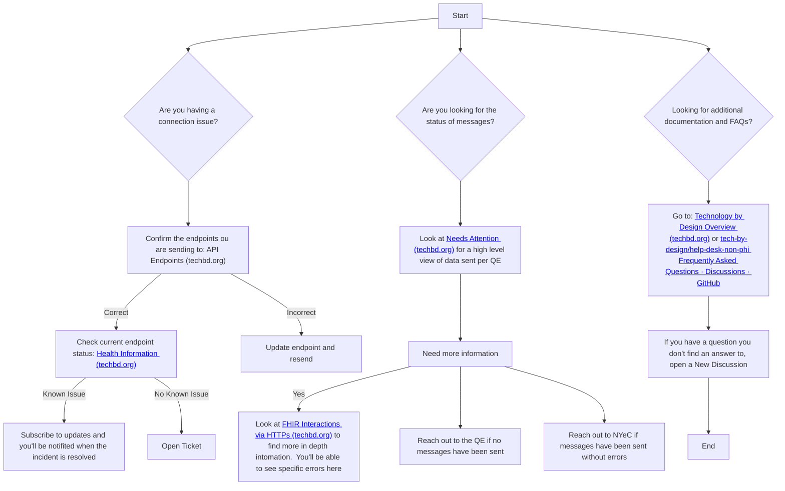

## Tech by Design Hub

The Tech by Design Hub is a custom developed user interface (UI) that was created to give insight into the transformation and exchange of messages sent by qualifying entities (QEs) by way of Tech by Design. The goal of the Hub is to provide anyone using this service with self-service capability and insight into what happened with their messages when they entered into the Tech by Design eco-system. The Hub has been developed "in the open" as much as possible in order to make all functionality both known and discoverable, in an effort to be transparent with the flow through the system.

Note that information is readily available via the Hub UI, but using the interface presents challenges for monitoring and alerting - as most user interfaces do. It is recommended that the QEs needing more regular insight utilize the Tech by Design Hub APIs to pull information in order to build out the reports, monitoring, or alerting that suits their business requirements most effectively.​

### Helpful Links
Here are some links we've compiled that may offer you assistance as you're working on the 1115 Waiver project with Technology by Design.

#### General Tech by Design Help
- [Tech by Design's Get Help page](https://techbd.org/get-help)
- [FAQ Section](https://github.com/tech-by-design/help-desk-non-phi/discussions/categories/frequently-asked-questions)
- [Open a Help Desk ticket/issue](https://github.com/tech-by-design/help-desk-non-phi/issues/new/choose)
  - When submitting a Help Desk ticket, please use the "Help Desk Ticket" template and try to fill out the information in the template with as much information as accurately as possible. 
  - Please remember that providing as much information possible, especially identifiers like the `interaction id` or `bundle id`, is crucial in reducing the elapsed time in triaging the issues you're presenting.

#### Tech by Design's Hub
- [Tech by Design's Hub page](https://techbd.org/hub)
- [Tech by Design Hub Status](https://status.techbd.org)
- [Tech by Deisgn Hub Docs](https://phi.hub.qa.techbd.org/docs/swagger-ui/techbd-api)

#### FHIR Implementation Guide or Validation Rules Questions
- [FHIR IG documentation](https://shinny.org/ImplementationGuide/HRSN/index.html)
- If your issue cannot be resolved, you should create a ticket in the [NYeC Data Lake Jira system](https://nyec.atlassian.net/servicedesk/customer/portal/19/user/login?destination=portal%2F19) for further assistance surrounding the Implementation Guide.

#### NYeC API Gateway and/or Data Lake Issues
- If you've utilized the Tech by Design Hub and recognize errors in forwarding to the data lake, please create a ticket in the [NYeC Data Lake Jira system](https://nyec.atlassian.net/servicedesk/customer/portal/18) for further assistance with non-Implementation Guide related issues.

### Flowchart

Below is a flowchart that will help you with decision-making for help around the 1115 Waiver project.

