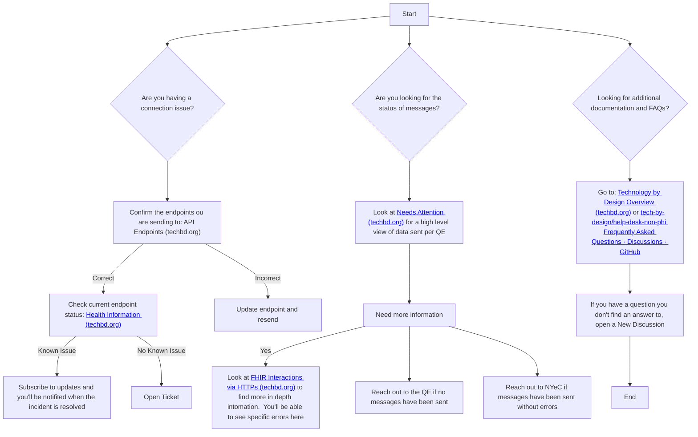

## Flowchart

```mermaid
flowchart TD
    A["Start"] --> B{"Are you having a connection issue?"} & D{"Are you looking for the status of messages?"} & F{"Looking for additional documentation and FAQs?"}
    B --> C["Confirm the endpoints ou are sending to: <a hryef="https://synthetic.fhir.api.devl.techbd.org/docs/techbd-hub">API Endpoints (techbd.org)</a>"]
    D --> E["Look at <a href="https://synthetic.fhir.api.devl.techbd.org/data-quality/needs-attention">Needs Attention (techbd.org)</a> for a high level view of data sent per QE"]
    F --> G["Go to: <a href="https://synthetic.fhir.api.devl.techbd.org/docs/techbd-hub">Technology by Design Overview (techbd.org)</a> or <a href="https://github.com/tech-by-design/help-desk-non-phi/discussions/categories/frequently-asked-questions">tech-by-design/help-desk-non-phi Frequently Asked Questions · Discussions · GitHub</a>"]
    C -- Correct --> I["Check current endpoint status: <a href="https://synthetic.fhir.api.devl.techbd.org/console/health-info">Health Information (techbd.org)</a><br>"]
    C -- Incorrect --> n4["Update endpoint and resend"]
    E --> J["Need more information"]
    G --> K["If you have a question you don't find an answer to, open a New Discussion"]
    I -- Known Issue --> Y["Subscribe to updates and you'll be notifited when the incident is resolved"]
    I -- No Known Issue --> X["Open Ticket"]
    K --> Z["End"]
    J -- Yes --> n5["Look at <a href="https://synthetic.fhir.api.devl.techbd.org/interactions/httpsfhir">FHIR Interactions via HTTPs (techbd.org)</a> to find more in depth intomation.  You'll be able to see specific errors here"]
    J --> n7["Reach out to the QE if no messages have been sent"] & n8["Reach out to NYeC if messages have been sent without errors"]
```